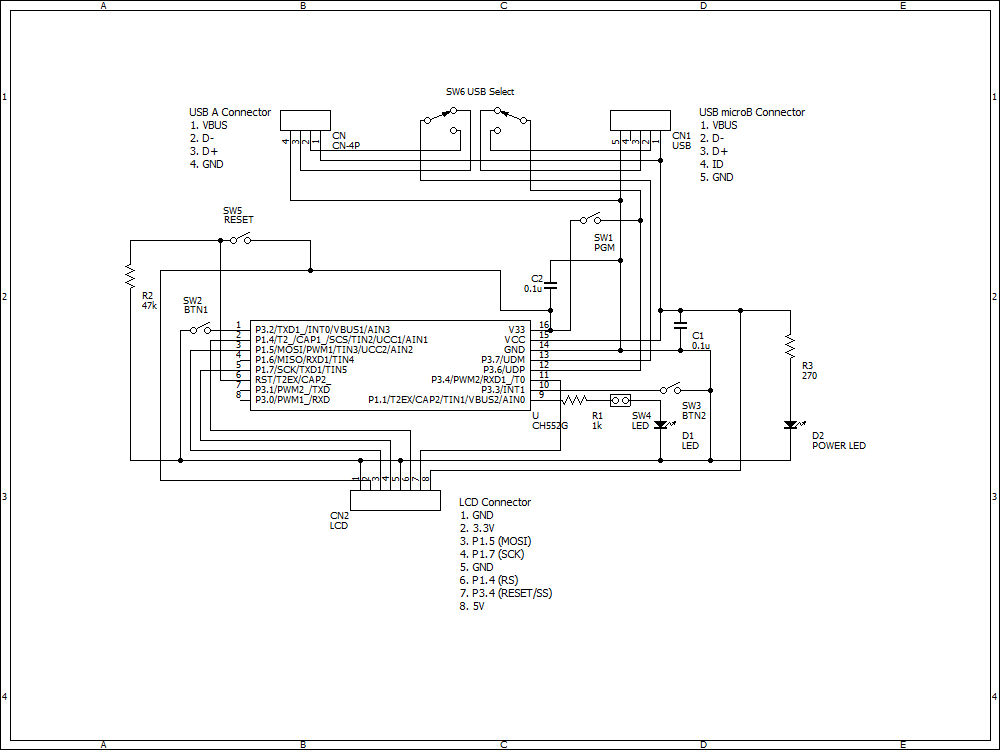

# CH55xduino_SPILCD
SPI LCD Library for CH55xduino (Supports ST7032/ST7036). 
Most functions are similar to the "LiquidCrysatal" library.
# How to install
Create a new folder(e.g. "SPI_LCD_CH55x") in the library folder of Arduino IDE, and place SPI_LCD.c, SPI_LCD.h, SPI_LCD_init.h, SPI_LCD_init_d.h into the folder. 
Edit SPI_LCD_init.h for initial settings. 
Include <SPI_LCD.h> to use this library.
# Symbolic constants defined in SPI_LCD_init.h
LCD_USEPRINT : Define this if you want to use LCD_Print(), LCD_Printi(), LCD_Printb() functions.  
　It requires about 1.3KB of additional program memories. 
LCD_RS_PIN : GPIO number for R/S signal. 
LCD_RST_PIN : GPIO number for LCD reset signal. 
LCD_DIGITS : Display digits of LCD. 
LCD_LINES : Display lines of LCD. 
LCD_CONT : Display contrast. (0-63, see datasheets of ST7032 and ST7036)  
LCD_RAB : Follower gain of LCD controller (0-7, see datasheets of ST7032 and ST7036) 
LCD_7032 : Define this when the LCD uses ST7032 for the controller. 
LCD_7036 : Define this when the LCD uses ST7036 for the controller. 
The default values are defined in SPI_LCD_init_d.h file.
# Reference of functions
1. void LCD_begin() : Initializes the LCD.
2. void LCD_clear() : Clears screen.
3. void LCD_home() : Moves the cursor to the home position.
4. void LCD_setCursor(column, row) : Moves the cursor to the specified potision.
5. uint8_t LCD_write(character) : Writes a character to the LCD. Returns the number of bytes written.
6. uint8_t LCD_prints(string) : Prints a string to the LCD. Returns the number of bytes written.
7. void LCD_display() : Turns on the LCD display.
8. void LCD_noDisplay() : Turns off the LCD display.
9. void LCD_cursor() : Display the LCD cursor.
10. void LCD_noCursor() : Hides the LCD cursor.
11. void LCD_sendCmd(command) : Sends a command data to the LCD.
# Reference of optional functions (Valid only if LCD_USEPRINT is defined)
All functions return the number of bytes written.
1. uint8_t LCD_printb(data, base) : Prints a nunber(integer only) in the specified base.
2. uint8_t LCD_printi(data) : Prints a numbner(integer only).
3. uint8_t LCD_print(data) : Prints a numbner(integer only) or a string.
4. uint8_t LCD_print(data, base) : Prints a nunber(integer only) in the specified base.
# Tested LCD modules
COG1602A (ST7032) : 5V, Booster ON, Contrast 25, Rab 4 (Use default SPI_LCD_init_d.h) 
EA DOGM163 (ST7036) : 5V, Booster OFF, Contrast 25, Rab 4 (Use SPI_LCD_init_7036.h)
# Test Circuit

